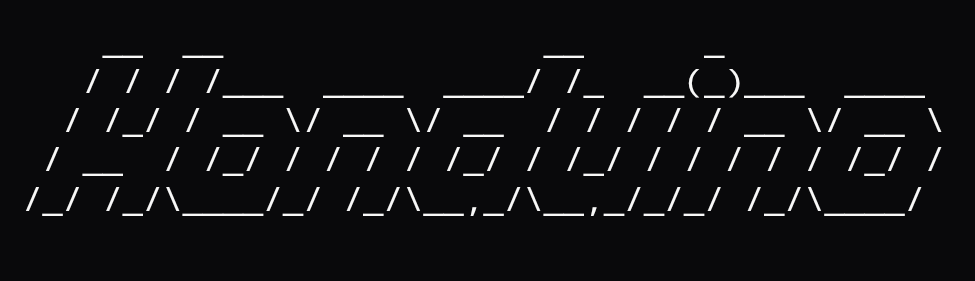

# Honduino (Honda_DLC-to-Arduino)
Interface Honda OBD (K-line) using a special protection circuit, Arduino and i2c screens
  
**K-Line Protection / Interface**
  
1 × 2N3904 NPN transistor (K-Line level shifting, optional depending on circuit)  
  
1 × Schottky diode (e.g., 1N5819) for K-Line protection  
  
1 × 1 kΩ resistor (series with K-Line)  
  
1 × 47 µF electrolytic capacitor (across K-Line and GND to absorb spikes)  
  
1 × 0.5 A fuse (inline with 12 V supply from DLC Pin2)  
  
Hook-up wires / perfboard for assembly
